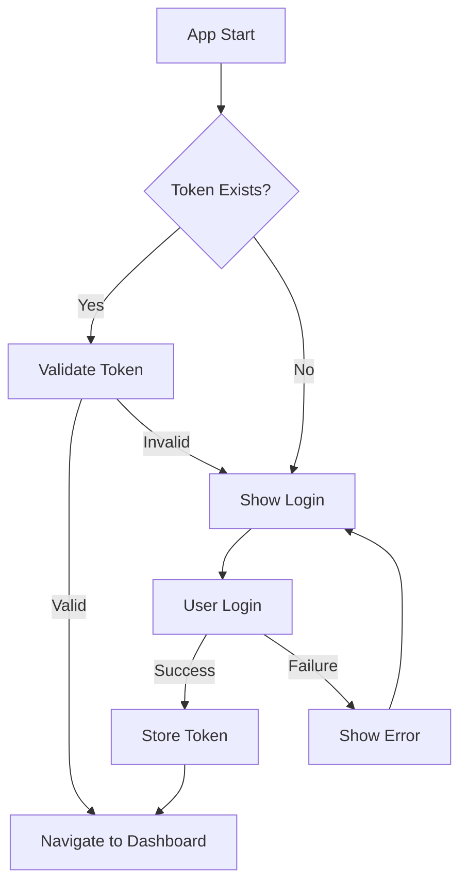
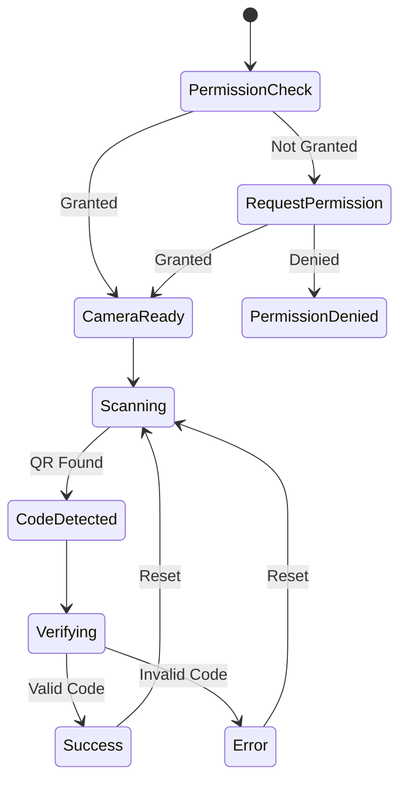

# Architecture Documentation

## System Overview

The QR Scanner Event Checker App follows a modular, component-based architecture built on React Native with Expo. The application is designed for scalability, maintainability, and cross-platform compatibility.

## Architecture Patterns

### 1. Component-Based Architecture
```
┌─────────────────────────────────────┐
│           Presentation Layer        │
├─────────────────────────────────────┤
│  Screens  │  Components  │  Hooks   │
├─────────────────────────────────────┤
│           Business Logic Layer      │
├─────────────────────────────────────┤
│  Services │  API Client │  Utils    │
├─────────────────────────────────────┤
│           Data Layer               │
├─────────────────────────────────────┤
│  Storage  │  Cache      │  State    │
└─────────────────────────────────────┘
```

### 2. Navigation Architecture
```
Root Layout
├── Authentication Stack
│   └── Login Screen
└── Tab Navigator
    ├── Dashboard Tab
    ├── Wristbands Tab
    ├── Scanner Tab
    └── Profile Screen (Modal)
```

### 3. State Management Pattern
- **Local State**: React hooks (useState, useEffect)
- **Global State**: Service-based singleton pattern
- **Persistent State**: Platform-specific storage (localStorage/AsyncStorage)

## Core Components

### 1. Authentication System

#### AuthService Architecture
```typescript
class AuthService {
  // Singleton pattern for global state
  private static token: string | null = null;
  private static userEmail: string | null = null;
  
  // Public interface
  static async login(email: string, password: string)
  static async logout()
  static async isAuthenticated(): Promise<boolean>
  static async getAuthHeaders(): Promise<HeadersInit>
  
  // Private methods
  private static async storeToken(token: string)
  private static clearLocalData()
}
```

#### Authentication Flow


### 2. API Service Layer

#### Service Architecture
```typescript
class ApiService {
  // Mock data simulation
  private static async mockRequest<T>(data: T): Promise<T>
  
  // Public API methods
  static async getVenueCapacity()
  static async getCheckersSummary()
  static async getWristbands()
  static async verifyWristband(qrCode: string)
  static async updateWristbandStatus(id: string, status: string)
}
```

#### Data Flow Pattern
```
Component Request → Service Method → Mock Delay → Data Response → Component Update
```

### 3. Camera Integration

#### Camera Component Architecture
```typescript
// Permission Management
const [permission, requestPermission] = useCameraPermissions();

// Camera Configuration
<CameraView
  style={styles.camera}
  onBarcodeScanned={handleBarCodeScanned}
  barcodeScannerSettings={{
    barcodeTypes: ['qr'],
  }}
>
  {/* Overlay Components */}
</CameraView>
```

#### Scanner State Machine


## Data Models

### 1. Type Definitions
```typescript
// User Authentication
interface LoginResponse {
  status: number;
  access_token: string;
  message?: string;
}

interface User {
  email: string;
  token: string;
}

// Venue Data
interface VenueCapacity {
  current: number;
  max: number;
  percentage: number;
}

interface CheckerData {
  id: string;
  name: string;
  scanned: number;
  verified: number;
  rejected: number;
}

// Wristband Management
interface Wristband {
  id: string;
  name: string;
  status: 'verified' | 'pending' | 'rejected';
  verifiedAt?: string;
  verifiedBy?: string;
}

interface VerificationResult {
  valid: boolean;
  message: string;
}
```

### 2. Data Validation
```typescript
// Input validation patterns
const validateEmail = (email: string): boolean => {
  const emailRegex = /^[^\s@]+@[^\s@]+\.[^\s@]+$/;
  return emailRegex.test(email);
};

const validateQRCode = (code: string): boolean => {
  return code && code.length > 0 && !code.includes('invalid');
};
```

## Component Hierarchy

### 1. Screen Components
```
app/
├── _layout.tsx                 # Root navigation setup
├── (auth)/
│   ├── _layout.tsx            # Auth stack navigator
│   └── login.tsx              # Login screen component
└── (tabs)/
    ├── _layout.tsx            # Tab navigator with headers
    ├── index.tsx              # Dashboard screen
    ├── wristbands.tsx         # Wristbands management
    ├── scanner.tsx            # QR scanner interface
    └── profile.tsx            # User profile
```

### 2. Reusable Components
```
components/
├── dashboard/
│   ├── VenueCapacity.tsx      # Capacity gauge component
│   └── CheckerSummary.tsx     # Performance table
└── wristbands/
    └── WristbandItem.tsx      # Individual wristband card
```

### 3. Component Communication
```typescript
// Parent to Child: Props
<VenueCapacity 
  current={capacity.current}
  max={capacity.max}
  percentage={capacity.percentage}
  isLoading={isLoading}
/>

// Child to Parent: Callbacks
<WristbandItem 
  wristband={item}
  onStatusChange={(id, status) => updateStatus(id, status)}
/>

// Sibling Communication: Shared State
const [selectedFilter, setSelectedFilter] = useState('all');
```

## Performance Optimization

### 1. Rendering Optimization
```typescript
// Memoization for expensive calculations
const memoizedValue = useMemo(() => {
  return expensiveCalculation(data);
}, [data]);

// Callback memoization
const memoizedCallback = useCallback((id: string) => {
  handleItemPress(id);
}, [handleItemPress]);

// Component memoization
const MemoizedComponent = React.memo(ExpensiveComponent);
```

### 2. List Performance
```typescript
// FlatList optimization
<FlatList
  data={filteredWristbands}
  renderItem={({ item }) => <WristbandItem wristband={item} />}
  keyExtractor={(item) => item.id}
  getItemLayout={(data, index) => ({
    length: ITEM_HEIGHT,
    offset: ITEM_HEIGHT * index,
    index,
  })}
  removeClippedSubviews={true}
  maxToRenderPerBatch={10}
  windowSize={10}
/>
```

### 3. Memory Management
```typescript
// Cleanup patterns
useEffect(() => {
  const interval = setInterval(fetchData, 30000);
  
  return () => {
    clearInterval(interval);
  };
}, []);

// Camera cleanup
useEffect(() => {
  return () => {
    // Camera resource cleanup
    if (cameraRef.current) {
      cameraRef.current.pausePreview();
    }
  };
}, []);
```

## Error Handling Strategy

### 1. Error Boundaries
```typescript
class ErrorBoundary extends React.Component {
  constructor(props) {
    super(props);
    this.state = { hasError: false };
  }

  static getDerivedStateFromError(error) {
    return { hasError: true };
  }

  componentDidCatch(error, errorInfo) {
    console.error('Error caught by boundary:', error, errorInfo);
  }

  render() {
    if (this.state.hasError) {
      return <ErrorFallback />;
    }

    return this.props.children;
  }
}
```

### 2. API Error Handling
```typescript
// Centralized error handling
const handleApiError = (error: Error): string => {
  if (error.message.includes('network')) {
    return 'Error de conexión. Verifique su internet.';
  } else if (error.message.includes('401')) {
    return 'Sesión expirada. Inicie sesión nuevamente.';
  } else {
    return 'Error del servidor. Intente más tarde.';
  }
};

// Usage in components
try {
  const data = await ApiService.getData();
  setData(data);
} catch (error) {
  const errorMessage = handleApiError(error);
  setError(errorMessage);
}
```

### 3. User Feedback Patterns
```typescript
// Loading states
const [isLoading, setIsLoading] = useState(false);

// Error states
const [error, setError] = useState<string | null>(null);

// Success feedback
const [notification, setNotification] = useState<{
  type: 'success' | 'error';
  message: string;
} | null>(null);
```

## Security Architecture

### 1. Authentication Security
```typescript
// Token storage
const storeToken = async (token: string) => {
  if (Platform.OS === 'web') {
    localStorage.setItem(AUTH_TOKEN_KEY, token);
  } else {
    // Use secure storage on mobile
    await SecureStore.setItemAsync(AUTH_TOKEN_KEY, token);
  }
};

// Request headers
const getAuthHeaders = async (): Promise<HeadersInit> => {
  const token = await getToken();
  return {
    'Content-Type': 'application/json',
    'Authorization': token ? `Bearer ${token}` : '',
  };
};
```

### 2. Input Validation
```typescript
// Client-side validation
const validateInput = (input: string): boolean => {
  // Sanitize and validate input
  const sanitized = input.trim();
  return sanitized.length > 0 && sanitized.length < 1000;
};

// QR code validation
const validateQRCode = (code: string): boolean => {
  // Check format and content
  return /^[A-Z0-9-]+$/.test(code);
};
```

### 3. Permission Management
```typescript
// Camera permissions
const requestCameraPermission = async () => {
  const { status } = await Camera.requestCameraPermissionsAsync();
  return status === 'granted';
};

// Permission state handling
if (!permission?.granted) {
  return <PermissionRequestScreen />;
}
```

## Testing Architecture

### 1. Component Testing
```typescript
// Unit test example
import { render, fireEvent } from '@testing-library/react-native';
import LoginScreen from '../login';

describe('LoginScreen', () => {
  it('should handle login submission', () => {
    const { getByPlaceholderText, getByText } = render(<LoginScreen />);
    
    fireEvent.changeText(getByPlaceholderText('Email'), 'test@example.com');
    fireEvent.changeText(getByPlaceholderText('Password'), 'password');
    fireEvent.press(getByText('Login'));
    
    // Assert expected behavior
  });
});
```

### 2. Service Testing
```typescript
// API service testing
describe('ApiService', () => {
  it('should verify wristband successfully', async () => {
    const result = await ApiService.verifyWristband('valid-code');
    expect(result.valid).toBe(true);
    expect(result.message).toContain('verificado');
  });
});
```

### 3. Integration Testing
```typescript
// End-to-end flow testing
describe('Authentication Flow', () => {
  it('should complete login to dashboard flow', async () => {
    // Test complete user journey
    await loginUser('test@example.com', 'password');
    await waitFor(() => expect(getDashboard()).toBeVisible());
  });
});
```

## Deployment Architecture

### 1. Build Configuration
```json
{
  "expo": {
    "name": "Event Checker App",
    "slug": "event-checker-app",
    "version": "1.0.0",
    "platforms": ["ios", "android", "web"],
    "web": {
      "bundler": "metro",
      "output": "static"
    },
    "ios": {
      "supportsTablet": true
    },
    "android": {
      "adaptiveIcon": {
        "foregroundImage": "./assets/images/icon.png",
        "backgroundColor": "#ffffff"
      }
    }
  }
}
```

### 2. Environment Management
```typescript
// Environment configuration
const config = {
  development: {
    apiUrl: 'http://localhost:3000/api',
    debug: true,
  },
  staging: {
    apiUrl: 'https://staging-api.example.com/api',
    debug: false,
  },
  production: {
    apiUrl: 'https://api.xolotlcl.com/api',
    debug: false,
  },
};

const getConfig = () => {
  const env = process.env.EXPO_PUBLIC_ENVIRONMENT || 'development';
  return config[env];
};
```

### 3. Platform-Specific Builds
```bash
# Web build
npx expo export:web

# iOS build
npx expo build:ios

# Android build
npx expo build:android

# Development build
npx expo install --fix
npx expo run:ios
npx expo run:android
```

## Monitoring and Analytics

### 1. Error Tracking
```typescript
// Error reporting
const reportError = (error: Error, context: string) => {
  if (__DEV__) {
    console.error(`Error in ${context}:`, error);
  } else {
    // Send to error tracking service
    ErrorTracker.captureException(error, { context });
  }
};
```

### 2. Performance Monitoring
```typescript
// Performance tracking
const trackPerformance = (operation: string, duration: number) => {
  if (duration > 1000) {
    console.warn(`Slow operation: ${operation} took ${duration}ms`);
  }
  
  // Send to analytics
  Analytics.track('performance', {
    operation,
    duration,
    timestamp: Date.now(),
  });
};
```

### 3. User Analytics
```typescript
// User behavior tracking
const trackUserAction = (action: string, properties?: object) => {
  Analytics.track(action, {
    ...properties,
    timestamp: Date.now(),
    platform: Platform.OS,
  });
};

// Usage
trackUserAction('qr_scan_success', { wristbandId: 'WB-123456' });
trackUserAction('login_attempt', { email: userEmail });
```

This architecture documentation provides a comprehensive overview of the system design, patterns, and implementation details that make the QR Scanner Event Checker App robust, maintainable, and scalable.