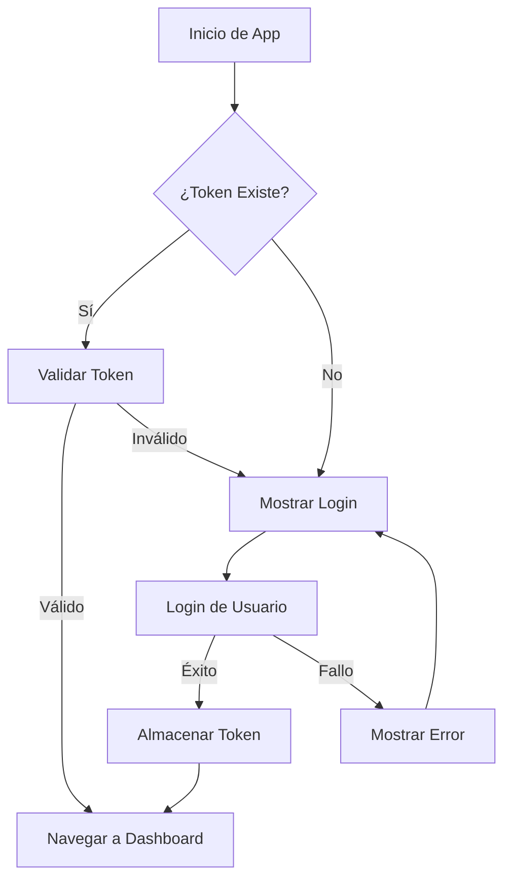
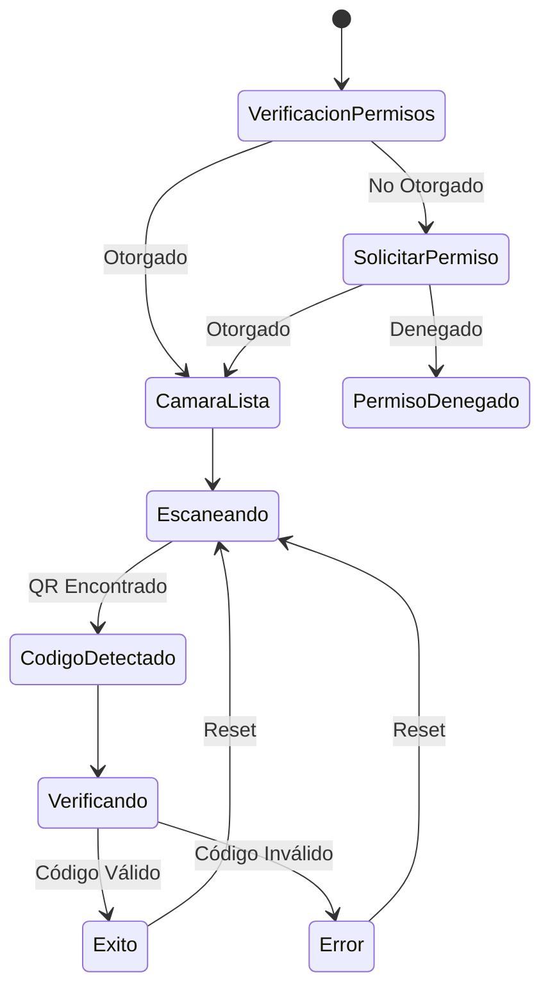

# Documentación de Arquitectura

## Visión General del Sistema

La Aplicación QR Scanner Event Checker sigue una arquitectura modular basada en componentes construida sobre React Native con Expo. La aplicación está diseñada para escalabilidad, mantenibilidad y compatibilidad multiplataforma.

## Patrones de Arquitectura

### 1. Arquitectura Basada en Componentes
```
┌─────────────────────────────────────┐
│           Capa de Presentación      │
├─────────────────────────────────────┤
│  Pantallas │  Componentes │  Hooks  │
├─────────────────────────────────────┤
│           Capa de Lógica de Negocio │
├─────────────────────────────────────┤
│  Servicios │  Cliente API │  Utils  │
├─────────────────────────────────────┤
│           Capa de Datos             │
├─────────────────────────────────────┤
│  Storage   │  Cache      │  Estado  │
└─────────────────────────────────────┘
```

### 2. Arquitectura de Navegación
```
Layout Raíz
├── Stack de Autenticación
│   └── Pantalla de Login
└── Navegador de Pestañas
    ├── Pestaña Dashboard
    ├── Pestaña Brazaletes
    ├── Pestaña Escáner
    └── Pantalla de Perfil (Modal)
```

### 3. Patrón de Gestión de Estado
- **Estado Local**: Hooks de React (useState, useEffect)
- **Estado Global**: Patrón singleton basado en servicios
- **Estado Persistente**: Almacenamiento específico de plataforma (localStorage/AsyncStorage)

## Componentes Centrales

### 1. Sistema de Autenticación

#### Arquitectura AuthService
```typescript
class AuthService {
  // Patrón singleton para estado global
  private static token: string | null = null;
  private static userEmail: string | null = null;
  
  // Interfaz pública
  static async login(email: string, password: string)
  static async logout()
  static async isAuthenticated(): Promise<boolean>
  static async getAuthHeaders(): Promise<HeadersInit>
  
  // Métodos privados
  private static async storeToken(token: string)
  private static clearLocalData()
}
```

#### Flujo de Autenticación


### 2. Capa de Servicio API

#### Arquitectura del Servicio
```typescript
class ApiService {
  // Simulación de datos mock
  private static async mockRequest<T>(data: T): Promise<T>
  
  // Métodos API públicos
  static async getVenueCapacity()
  static async getCheckersSummary()
  static async getWristbands()
  static async verifyWristband(qrCode: string)
  static async updateWristbandStatus(id: string, status: string)
}
```

#### Patrón de Flujo de Datos
```
Solicitud de Componente → Método de Servicio → Retraso Mock → Respuesta de Datos → Actualización de Componente
```

### 3. Integración de Cámara

#### Arquitectura del Componente de Cámara
```typescript
// Gestión de Permisos
const [permission, requestPermission] = useCameraPermissions();

// Configuración de Cámara
<CameraView
  style={styles.camera}
  onBarcodeScanned={handleBarCodeScanned}
  barcodeScannerSettings={{
    barcodeTypes: ['qr'],
  }}
>
  {/* Componentes de Overlay */}
</CameraView>
```

#### Máquina de Estados del Escáner


## Modelos de Datos

### 1. Definiciones de Tipos
```typescript
// Autenticación de Usuario
interface LoginResponse {
  status: number;
  access_token: string;
  message?: string;
}

interface User {
  email: string;
  token: string;
}

// Datos del Venue
interface VenueCapacity {
  current: number;
  max: number;
  percentage: number;
}

interface CheckerData {
  id: string;
  name: string;
  scanned: number;
  verified: number;
  rejected: number;
}

// Gestión de Brazaletes
interface Wristband {
  id: string;
  name: string;
  status: 'verified' | 'pending' | 'rejected';
  verifiedAt?: string;
  verifiedBy?: string;
}

interface VerificationResult {
  valid: boolean;
  message: string;
}
```

### 2. Validación de Datos
```typescript
// Patrones de validación de entrada
const validateEmail = (email: string): boolean => {
  const emailRegex = /^[^\s@]+@[^\s@]+\.[^\s@]+$/;
  return emailRegex.test(email);
};

const validateQRCode = (code: string): boolean => {
  return code && code.length > 0 && !code.includes('invalid');
};
```

## Jerarquía de Componentes

### 1. Componentes de Pantalla
```
app/
├── _layout.tsx                 # Configuración de navegación raíz
├── (auth)/
│   ├── _layout.tsx            # Navegador de stack de autenticación
│   └── login.tsx              # Componente de pantalla de login
└── (tabs)/
    ├── _layout.tsx            # Navegador de pestañas con encabezados
    ├── index.tsx              # Pantalla de dashboard
    ├── wristbands.tsx         # Gestión de brazaletes
    ├── scanner.tsx            # Interfaz de escáner QR
    └── profile.tsx            # Perfil de usuario
```

### 2. Componentes Reutilizables
```
components/
├── dashboard/
│   ├── VenueCapacity.tsx      # Componente medidor de capacidad
│   └── CheckerSummary.tsx     # Tabla de rendimiento
└── wristbands/
    └── WristbandItem.tsx      # Tarjeta individual de brazalete
```

### 3. Comunicación de Componentes
```typescript
// Padre a Hijo: Props
<VenueCapacity 
  current={capacity.current}
  max={capacity.max}
  percentage={capacity.percentage}
  isLoading={isLoading}
/>

// Hijo a Padre: Callbacks
<WristbandItem 
  wristband={item}
  onStatusChange={(id, status) => updateStatus(id, status)}
/>

// Comunicación entre Hermanos: Estado Compartido
const [selectedFilter, setSelectedFilter] = useState('all');
```

## Optimización de Rendimiento

### 1. Optimización de Renderizado
```typescript
// Memoización para cálculos costosos
const memoizedValue = useMemo(() => {
  return expensiveCalculation(data);
}, [data]);

// Memoización de callbacks
const memoizedCallback = useCallback((id: string) => {
  handleItemPress(id);
}, [handleItemPress]);

// Memoización de componentes
const MemoizedComponent = React.memo(ExpensiveComponent);
```

### 2. Rendimiento de Listas
```typescript
// Optimización de FlatList
<FlatList
  data={filteredWristbands}
  renderItem={({ item }) => <WristbandItem wristband={item} />}
  keyExtractor={(item) => item.id}
  getItemLayout={(data, index) => ({
    length: ITEM_HEIGHT,
    offset: ITEM_HEIGHT * index,
    index,
  })}
  removeClippedSubviews={true}
  maxToRenderPerBatch={10}
  windowSize={10}
/>
```

### 3. Gestión de Memoria
```typescript
// Patrones de limpieza
useEffect(() => {
  const interval = setInterval(fetchData, 30000);
  
  return () => {
    clearInterval(interval);
  };
}, []);

// Limpieza de cámara
useEffect(() => {
  return () => {
    // Limpieza de recursos de cámara
    if (cameraRef.current) {
      cameraRef.current.pausePreview();
    }
  };
}, []);
```

## Estrategia de Manejo de Errores

### 1. Límites de Error
```typescript
class ErrorBoundary extends React.Component {
  constructor(props) {
    super(props);
    this.state = { hasError: false };
  }

  static getDerivedStateFromError(error) {
    return { hasError: true };
  }

  componentDidCatch(error, errorInfo) {
    console.error('Error capturado por boundary:', error, errorInfo);
  }

  render() {
    if (this.state.hasError) {
      return <ErrorFallback />;
    }

    return this.props.children;
  }
}
```

### 2. Manejo de Errores API
```typescript
// Manejo centralizado de errores
const handleApiError = (error: Error): string => {
  if (error.message.includes('network')) {
    return 'Error de conexión. Verifique su internet.';
  } else if (error.message.includes('401')) {
    return 'Sesión expirada. Inicie sesión nuevamente.';
  } else {
    return 'Error del servidor. Intente más tarde.';
  }
};

// Uso en componentes
try {
  const data = await ApiService.getData();
  setData(data);
} catch (error) {
  const errorMessage = handleApiError(error);
  setError(errorMessage);
}
```

### 3. Patrones de Retroalimentación al Usuario
```typescript
// Estados de carga
const [isLoading, setIsLoading] = useState(false);

// Estados de error
const [error, setError] = useState<string | null>(null);

// Retroalimentación de éxito
const [notification, setNotification] = useState<{
  type: 'success' | 'error';
  message: string;
} | null>(null);
```

## Arquitectura de Seguridad

### 1. Seguridad de Autenticación
```typescript
// Almacenamiento de tokens
const storeToken = async (token: string) => {
  if (Platform.OS === 'web') {
    localStorage.setItem(AUTH_TOKEN_KEY, token);
  } else {
    // Usar almacenamiento seguro en móvil
    await SecureStore.setItemAsync(AUTH_TOKEN_KEY, token);
  }
};

// Encabezados de solicitud
const getAuthHeaders = async (): Promise<HeadersInit> => {
  const token = await getToken();
  return {
    'Content-Type': 'application/json',
    'Authorization': token ? `Bearer ${token}` : '',
  };
};
```

### 2. Validación de Entrada
```typescript
// Validación del lado del cliente
const validateInput = (input: string): boolean => {
  // Sanitizar y validar entrada
  const sanitized = input.trim();
  return sanitized.length > 0 && sanitized.length < 1000;
};

// Validación de código QR
const validateQRCode = (code: string): boolean => {
  // Verificar formato y contenido
  return /^[A-Z0-9-]+$/.test(code);
};
```

### 3. Gestión de Permisos
```typescript
// Permisos de cámara
const requestCameraPermission = async () => {
  const { status } = await Camera.requestCameraPermissionsAsync();
  return status === 'granted';
};

// Manejo de estado de permisos
if (!permission?.granted) {
  return <PermissionRequestScreen />;
}
```

## Arquitectura de Pruebas

### 1. Pruebas de Componentes
```typescript
// Ejemplo de prueba unitaria
import { render, fireEvent } from '@testing-library/react-native';
import LoginScreen from '../login';

describe('LoginScreen', () => {
  it('debería manejar envío de login', () => {
    const { getByPlaceholderText, getByText } = render(<LoginScreen />);
    
    fireEvent.changeText(getByPlaceholderText('Email'), 'test@example.com');
    fireEvent.changeText(getByPlaceholderText('Password'), 'password');
    fireEvent.press(getByText('Login'));
    
    // Afirmar comportamiento esperado
  });
});
```

### 2. Pruebas de Servicios
```typescript
// Pruebas de servicio API
describe('ApiService', () => {
  it('debería verificar brazalete exitosamente', async () => {
    const result = await ApiService.verifyWristband('valid-code');
    expect(result.valid).toBe(true);
    expect(result.message).toContain('verificado');
  });
});
```

### 3. Pruebas de Integración
```typescript
// Pruebas de flujo end-to-end
describe('Flujo de Autenticación', () => {
  it('debería completar flujo de login a dashboard', async () => {
    // Probar viaje completo del usuario
    await loginUser('test@example.com', 'password');
    await waitFor(() => expect(getDashboard()).toBeVisible());
  });
});
```

## Arquitectura de Despliegue

### 1. Configuración de Build
```json
{
  "expo": {
    "name": "Event Checker App",
    "slug": "event-checker-app",
    "version": "1.0.0",
    "platforms": ["ios", "android", "web"],
    "web": {
      "bundler": "metro",
      "output": "static"
    },
    "ios": {
      "supportsTablet": true
    },
    "android": {
      "adaptiveIcon": {
        "foregroundImage": "./assets/images/icon.png",
        "backgroundColor": "#ffffff"
      }
    }
  }
}
```

### 2. Gestión de Entornos
```typescript
// Configuración de entorno
const config = {
  development: {
    apiUrl: 'http://localhost:3000/api',
    debug: true,
  },
  staging: {
    apiUrl: 'https://staging-api.example.com/api',
    debug: false,
  },
  production: {
    apiUrl: 'https://api.xolotlcl.com/api',
    debug: false,
  },
};

const getConfig = () => {
  const env = process.env.EXPO_PUBLIC_ENVIRONMENT || 'development';
  return config[env];
};
```

### 3. Builds Específicos de Plataforma
```bash
# Build web
npx expo export:web

# Build iOS
npx expo build:ios

# Build Android
npx expo build:android

# Build de desarrollo
npx expo install --fix
npx expo run:ios
npx expo run:android
```

## Monitoreo y Análisis

### 1. Seguimiento de Errores
```typescript
// Reporte de errores
const reportError = (error: Error, context: string) => {
  if (__DEV__) {
    console.error(`Error en ${context}:`, error);
  } else {
    // Enviar a servicio de seguimiento de errores
    ErrorTracker.captureException(error, { context });
  }
};
```

### 2. Monitoreo de Rendimiento
```typescript
// Seguimiento de rendimiento
const trackPerformance = (operation: string, duration: number) => {
  if (duration > 1000) {
    console.warn(`Operación lenta: ${operation} tomó ${duration}ms`);
  }
  
  // Enviar a análisis
  Analytics.track('performance', {
    operation,
    duration,
    timestamp: Date.now(),
  });
};
```

### 3. Análisis de Usuario
```typescript
// Seguimiento de comportamiento de usuario
const trackUserAction = (action: string, properties?: object) => {
  Analytics.track(action, {
    ...properties,
    timestamp: Date.now(),
    platform: Platform.OS,
  });
};

// Uso
trackUserAction('qr_scan_success', { wristbandId: 'WB-123456' });
trackUserAction('login_attempt', { email: userEmail });
```

Esta documentación de arquitectura proporciona una visión integral del diseño del sistema, patrones e detalles de implementación que hacen que la Aplicación QR Scanner Event Checker sea robusta, mantenible y escalable.